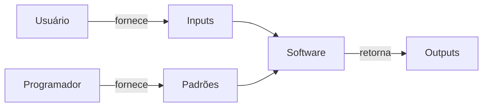
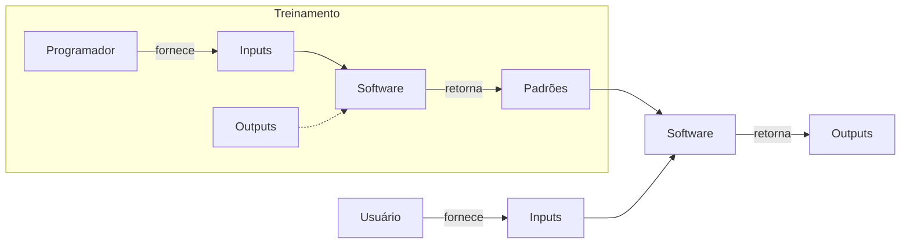

Uma definição interessante, retirada do livro 1, página 3, é:
$$
\text{O Machine Learning é uma abordagem para (1) aprender (2) padrões complexos a partir de (3) dados existentes e usar esses padrões para fazer (4) predições sobre (5) dados desconhecidos.}
$$
De acordo com o livro, só se deve utilizar o aprendizado de máquina, ou *Machine Learning* (ML), quando todos os aspectos dessa definição estiverem presentes.
## Sistemas Tradicionais x Sistemas de ML
A construção de um sistema de ML, diferentemente de um software tradicional, não é baseada nas regras definidas pelo programador, mas sim em dados. Abaixo está listado o fluxo de trabalho normalmente seguido por softwares tradicionais:
1. O **programador** fornece um conjunto de instruções/regras, ou **padrões**, para o **software**.
2. O **usuário** fornece dados de entrada (**input**) para o **software**.
3. O **software** retorna ao **usuário** o dado processado (**output**).

Por outro lado, o *Machine Learning* funciona assim:
  1. O **programador** fornece os dados de entrada (**input**) para o **software**.
2. O **software** retorna ao programador as regras, ou **padrões**.
3. O **usuário** fornece novos dados de entrada (**novos inputs**) para o **software**.
4. O **software** retorna ao **usuário** os dados de saída (**output**).

Esses sistemas podem ser de naturezas diferentes. Comumente, segmentamos os sistemas de ML em três tipos: [[ML Supervisionado|supervisionados]], [[ML não Supervisionado|não supervisionados]] e *reinforcement learning*.
## Requisitos de um Sistema de ML
Projetos de ML precisam ter algumas características importantes para que funcionem de forma eficiente e segura: confiabilidade, escalabilidade, manutenabilidade e adaptabilidade.
### Confiabilidade
Na engenharia de software tradicional costuma ser fácil identificar quando um sistema falha, uma vez que o usuário deverá receber uma mensagem de erro (ex.: erro 404, por exemplo). Diferentemente, sistemas de ML podem falhar sem o usuário saber que ele está falhando, tornando-o portanto mais difícil de identificar a sua confiabilidade.
Imagine, por exemplo, que você acessa o Google Tradutor e digita uma palavra em sua língua nativa para ser traduzida para uma língua que desconhece. Nessa situação, perceba que é difícil garantir que o sistema é confiável, principalmente quando não temos o *Ground Truth*.
Portanto, é necessário o desenvolvimento de uma estratégia que garanta a confiabilidade da aplicação de ML. 
// TODO: Linkar aqui metodologia para garantir a confiabilidade
### Escalabilidade
Um sistema de ML pode crescer de diferentes maneiras, em: complexidade, quantidade de modelos, volume de tráfego e outros.
Imagine, por exemplo, que você fez o *deploy* de um sistema de Machine Learning ano passado, naquele momento esse sistema, que é um classificador, estava usando uma regressão logística simples. Nesse cenário, com a finalidade de otimizar recursos, você utilizou uma máquina simples que era suficiente com apenas alguns poucos gigabytes de RAM. Alterações recentes, forçaram o modelo a deixar essa solução simples para uma rede neural que exige bem mais processamento do que a solução anterior. Esse é um típico caso em que o sistema de ML cresceu em complexidade.
Um crescimento em volume de tráfego é fácil de imaginar... Imagine que você desenvolveu um sistema de ML que está sendo utilizado por uma pequena equipe do seu trabalho para prever o orçamento necessário para o projeto nos próximos semestres. Essa pequena equipe está gerando essas previsões mensalmente, alimentando-o com os dados mais recentes, através de requisições por API. Imagine agora que seu sistema foi um sucesso, entregando bons resultados e ajudando a equipe a se planejar de forma mais eficiente. Esse sistema chamou a atenção da diretoria que resolveu abrir para toda a empresa. É de se esperar, portanto, que a demanda no volume de tráfego será bem maior que anteriormente.
Para exemplificar o crescimento em quantidade de modelos, voltemos a situação hipotética anterior. Imagine agora que após escalar seu sistema de ML para atender a toda a empresa, a diretoria fez a requisição para que criasse vários outros modelos, como: previsão de churn, recomendação de produtos e análise de sentimentos. Nesse cenário, a infraestrutura do sistema precisará ser capaz de suportar a criação e o treinamento de múltiplos modelos simultaneamente, o que pode exigir uma arquitetura mais robusta e escalável.
Para todos esses cenários, é importante considerar que o sistema pode vir a ser escalável no futuro e portanto é necessário possuir estratégias para que isso aconteça.
//TODO: Escrever estratégias de escalabilidades
### Manutenibilidade
O sistema de ML deve ser projetado de uma maneira que facilite o entendimento, operação e colaboração de todos os envolvidos do projeto. Apesar do sistema de ML ser normalmente desenvolvido pelo cientista de dados, profissionais diferentes podem acessar e colaborar, como o *Subject Matter Experts* (SMEs), engenheiros de DevOps, engenheiros de dados, desenvolvedores, arquitetos de software, *project managers* e outros. Portanto, é essencial seguir boas práticas de desenvolvimento, manter o código limpo e documentado, versionar código, dados e artefatos, além de muitas outras estratégias de manutenibilidade.
//TODO: Traçar estratégias de manutenibilidade.
### Adaptabilidade
Sistemas de ML devem ser adaptáveis a mudanças no ambiente, dados e requisitos do negócio. A adaptabilidade é crucial para garantir que o sistema continue a fornecer valor ao longo do tempo, mesmo quando as condições mudam.
Um exemplo de adaptabilidade em sistemas de ML é a capacidade de ajustar os modelos de acordo com novas informações ou mudanças nos dados. Por exemplo, se um modelo de previsão de vendas foi treinado com dados de um determinado período, mas as condições de mercado mudaram significativamente, o modelo deve ser capaz de se adaptar a essas novas condições para continuar a fornecer previsões precisas.
Para tal é importante implementar estratégias de adaptabilidade.
// TODO: escrever estratégias de adaptabilidade.
## Referências
1. [Projetando Sistemas de Machine Learning: processos iterativos para aplicações prontas para produção](https://www.amazon.com.br/Projetando-Sistemas-Machine-Learning-Interativo/dp/8550819670/ref=sr_1_1?__mk_pt_BR=%C3%85M%C3%85%C5%BD%C3%95%C3%91&crid=1AIQORVVYH35T&dib=eyJ2IjoiMSJ9.1fFwyO9dsVdtFWaK9KCgLTADtIptUC5Zcjl-R2I5v1TTnl7fcap_sju1Cjz4BOKBfKvKfV5unN-4CRjZy5PJrDm9JSfu6l8nX3Ws9itlpXw.erehvzDQ6xVeakGSqjSA1TgViauZyT7vi9QCSvcfAH4&dib_tag=se&keywords=projetando+sistemas+de+machine+learning&qid=1756137669&sprefix=projetando+sistemas%2Caps%2C259&sr=8-1&ufe=app_do%3Aamzn1.fos.6d798eae-cadf-45de-946a-f477d47705b9)
2. [Python Data Science: Unsupervised Machine Learning](https://ibm-learning.udemy.com/course/data-science-in-python-unsupervised-learning/learn/lecture/43380936#questions/22450621)