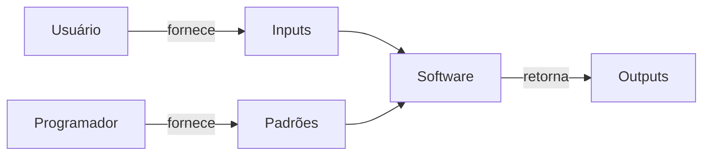
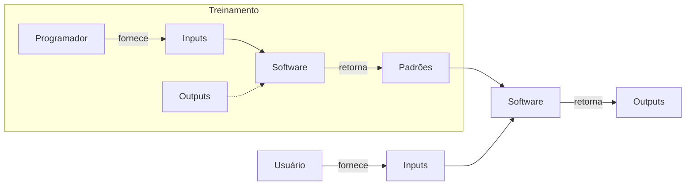

# 1. Definição
$$
\text{O Machine Learning é uma abordagem para (1) aprender (2) padrões complexos a partir de (3) dados existentes e usar esses padrões para fazer (4) predições sobre (5) dados desconhecidos.}
$$
A definição acima foi retirada do livro[^1] e ela serve como parâmetro na investigação do profissional em avaliar se justifica-se utiliza aprendizado de máquina, ou *Machine Learning* (ML), quando todos os aspectos dessa definição estiverem presentes.
# 2. Sistemas Tradicionais x Sistemas de ML
A construção de um sistema de ML, diferentemente de um software tradicional, não é baseada nas regras definidas pelo programador, mas sim em dados. Abaixo está listado o fluxo de trabalho normalmente seguido por softwares tradicionais:
1. O **programador** fornece um conjunto de instruções/regras, ou **padrões**, para o **software**.
2. O **usuário** fornece dados de entrada (**input**) para o **software**.
3. O **software** retorna ao **usuário** o dado processado (**output**).

Por outro lado, o *Machine Learning* funciona assim:
  1. O **programador** fornece os dados de entrada (**input**) para o **software**.
2. O **software** retorna ao programador as regras, ou **padrões**.
3. O **usuário** fornece novos dados de entrada (**novos inputs**) para o **software**.
4. O **software** retorna ao **usuário** os dados de saída (**output**).

Esses sistemas podem ser de naturezas diferentes. Comumente, segmentamos os sistemas de ML em três tipos: [[ML Supervisionado|supervisionados]], [[ML não Supervisionado|não supervisionados]] e *reinforcement learning*.
# 3. Requisitos de um Sistema de ML
Projetos de ML precisam ter algumas características importantes para que funcionem de forma eficiente e segura: confiabilidade, escalabilidade, manutenibilidade e adaptabilidade.
## 3.1. Confiabilidade
Na engenharia de software tradicional costuma ser fácil identificar quando um sistema falha, uma vez que o usuário deverá receber uma mensagem de erro (ex.: erro 404, por exemplo). Diferentemente, sistemas de ML podem falhar sem o usuário saber que ele está falhando, tornando-o portanto mais difícil de identificar a sua confiabilidade.
Imagine, por exemplo, que você acessa o Google Tradutor e digita uma palavra em sua língua nativa para ser traduzida para uma língua que desconhece. Nessa situação, perceba que é difícil garantir que o sistema é confiável, principalmente quando não temos o *Ground Truth*.
Portanto, é necessário o desenvolvimento de uma estratégia que garanta a confiabilidade da aplicação de ML. 
#TODO: Linkar aqui metodologia para garantir a confiabilidade
## 3.2. Escalabilidade
Um sistema de ML pode crescer de diferentes maneiras, em: complexidade, quantidade de modelos, volume de tráfego e outros.
Imagine, por exemplo, que você fez o *deploy* de um sistema de Machine Learning ano passado, naquele momento esse sistema, que é um classificador, estava usando uma regressão logística simples. Nesse cenário, com a finalidade de otimizar recursos, você utilizou uma máquina simples que era suficiente com apenas alguns poucos gigabytes de RAM. Alterações recentes, forçaram o modelo a deixar essa solução simples para uma rede neural que exige bem mais processamento do que a solução anterior. Esse é um típico caso em que o sistema de ML cresceu em complexidade.
Um crescimento em volume de tráfego é fácil de imaginar... Imagine que você desenvolveu um sistema de ML que está sendo utilizado por uma pequena equipe do seu trabalho para prever o orçamento necessário para o projeto nos próximos semestres. Essa pequena equipe está gerando essas previsões mensalmente, alimentando-o com os dados mais recentes, através de requisições por API. Imagine agora que seu sistema foi um sucesso, entregando bons resultados e ajudando a equipe a se planejar de forma mais eficiente. Esse sistema chamou a atenção da diretoria que resolveu abrir para toda a empresa. É de se esperar, portanto, que a demanda no volume de tráfego será bem maior que anteriormente.
Para exemplificar o crescimento em quantidade de modelos, voltemos a situação hipotética anterior. Imagine agora que após escalar seu sistema de ML para atender a toda a empresa, a diretoria fez a requisição para que criasse vários outros modelos, como: previsão de churn, recomendação de produtos e análise de sentimentos. Nesse cenário, a infraestrutura do sistema precisará ser capaz de suportar a criação e o treinamento de múltiplos modelos simultaneamente, o que pode exigir uma arquitetura mais robusta e escalável.
Para todos esses cenários, é importante considerar que o sistema pode vir a ser escalável no futuro e portanto é necessário possuir estratégias para que isso aconteça.
#TODO: Escrever estratégias de escalabilidades
## 3.3. Manutenibilidade
O sistema de ML deve ser projetado de uma maneira que facilite o entendimento, operação e colaboração de todos os envolvidos do projeto. Apesar do sistema de ML ser normalmente desenvolvido pelo cientista de dados, profissionais diferentes podem acessar e colaborar, como o *Subject Matter Experts* (SMEs), engenheiros de DevOps, engenheiros de dados, desenvolvedores, arquitetos de software, *project managers* e outros. Portanto, é essencial seguir boas práticas de desenvolvimento, manter o código limpo e documentado, versionar código, dados e artefatos, além de muitas outras estratégias de manutenibilidade.
#TODO: Traçar estratégias de manutenibilidade.
## 3.4. Adaptabilidade
Sistemas de ML devem ser adaptáveis a mudanças no ambiente, dados e requisitos do negócio. A adaptabilidade é crucial para garantir que o sistema continue a fornecer valor ao longo do tempo, mesmo quando as condições mudam.
Um exemplo de adaptabilidade em sistemas de ML é a capacidade de ajustar os modelos de acordo com novas informações ou mudanças nos dados. Por exemplo, se um modelo de previsão de vendas foi treinado com dados de um determinado período, mas as condições de mercado mudaram significativamente, o modelo deve ser capaz de se adaptar a essas novas condições para continuar a fornecer previsões precisas.
Para tal é importante implementar estratégias de adaptabilidade.
#TODO: escrever estratégias de adaptabilidade.
# 4. Playbook
Desenvolver um projeto de machine learning é um processo **iterativo** e **interminável**. Iterativo pois possui um passo-a-passo não sequencial e não linear, que se necessário retorna as etapas anteriormente já realizadas, ou ainda avança para etapas futuras conforme a necessidade. E é interminável, pois é um processo que mesmo após colocado em produção, exige monitoramento e aprendizado contínuo.
Existem várias metodologias para se implementar um sistema de ML, dentre os mais conhecidos, o CRISP-DM ou o KDD. Entretanto, de uma maneira holística podemos resumidamente falar que o processo de desenvolvimento de um sistema de ML, passa pelos seguintes estágios:
![[Pasted image 20250919165138.png]]
- [ ] Escopo do Projeto
	- [ ] Delimite o problema
	- [ ] Identifique a natureza do problema
	- [ ] Estime os recursos necessários
	- [ ] Monte a equipe do projeto
	- [ ] Crie um plano de ação com timelines
- [ ] [[Data Engineering]]
	- [ ] Data Quality Checks
	- [ ] 
- [ ] Desenvolvimento de Modelos de [[Aprendizado de Máquina|ML]]
- [ ] Implementação
- [ ] Monitoramento e Aprendizagem Contínua
- [ ] Análise de Negócios
## 4.1. Escopo do projeto
É nessa etapa que se define metas, objetivos, estimasse alocação de recursos financeiros e humanos, monta-se uma equipe, defini-se um plano de ação com timelines e outras atividades dessa natureza. Segue o *checklist*:
- [ ] [[#4.1.1. Traduzir para um problema de machine learning|Traduzir para um problema de machine learning]]
- [ ] [[#4.1.2. Verificar se é um problema de *machine learning*|Verificar se é um problema de machine learning]]
- [ ] [[#4.1.3. Delimitando o problema|Delimite o problema]]
- [ ] Estime os recursos necessários
- [ ] Monte a equipe do projeto
- [ ] Crie um plano de ação com timelines
### 4.1.1. Traduzir para um problema de *machine learning*
Muitas vezes a demanda por um sistema de *machine learning* origina-se de um requisito de negócio que está de acordo com a estratégia da empresa. Portanto, essa demanda virá em forma de um **problema de negócios**. Portanto, a primeira atividade a ser realizada é traduzir esse problema de negócio em um problema de *machine learning*. Isso envolve investigar profundamente o problema e tentar encontrar as causas e motivações, levando assim a um problema que poderá ser resolvido com técnicas de aprendizado de máquina.
Imagine a situação em que você é um cientista de dados em um banco e seu chefe ao observar uma empresa concorrente, percebeu que a satisfação e retenção dos clientes do concorrente melhoraram após eles implementarem um sistema de ML. De olho em melhorar também a satisfação dos seus clientes, o seu chefe solicita a você que desenvolva um sistema de ML que melhore a retenção de clientes, ou seja que **diminua o *churn* na empresa**. Perceba, portanto, que a solicitação do seu chefe não se trata de um problema de *machine learning*, mas sim de negócios.
Nessa situação, após investigação, imagine que você percebeu que os clientes que ligaram ao SAC com reclamações, permaneceram bastante tempo na linha e suas demandas não foram atendidas, sendo esse o principal motivo de descontentamento com sua empresa e levando muitos desses clientes ao *churn*. 
Um *insight* que foi possível retirar da análise exploratória é que esses clientes foram transferidos muitas vezes até serem redirecionados ao departamento correto. Nessa situação você percebe que poderia criar um modelo de *machine learning* que classifica o setor de atendimento ao cliente e direciona as chamadas para o departamento apropriado, melhorando assim a experiência do cliente e potencialmente reduzindo o churn.
Por fim, temos então um problema de *machine learning*: "criar um sistema de classificação para determinar corretamente o departamento responsável por atender a demanda do cliente."
### 4.1.2. Verificar se é um problema de *machine learning*
De acordo com a autora Chip Huyen[^3]: "O Machine Learning é uma abordagem para (1) aprender (2) padrões complexos a partir de (3) dados existentes e usar esses padrões para fazer (4) predições sobre (5) dados desconhecidos". 
1. **Aprender:** a premissa básica da implementação de um sistema de *machine learning* é que o seu objetivo seja aprender sobre algo. Como alternativa, seu objetivo poderia ser também entender ou descobrir algo, mas não necessariamente aprender. Logo, é necessário ter a compreensão clara de que seu objetivo seja aprender.
2. **Padrões complexos:** primeiramente é necessário que o fenômeno analisado tenha algum padrão, não faria sentido por exemplo criar um sistema de *machine learning* para prever o lançamento de um dado. Além disso, os padrões precisam ser ainda complexos, uma vez que padrões simples podem ser facilmente calculados por alguma fórmula determinística, ou alguma outra maneira mais fácil e eficiente.
3. **Dados existentes:** Imagine criar um sistema de predição de receita para uma empresa que não possui nenhum dado. Algoritmos de *machine learning* utilizam dados para criar a lógica dos padrões, portanto não tem como ter sistema de *machine learning* sem dados.
4. **Predições:** O resultado de um sistema de *machine learning* são predições, portanto a expectativa do *output* são predições, que podem ser valores numéricos ou categorias.
5. **Dados desconhecidos:** As predições serão interessantes somente em dados desconhecidos, uma vez que não adianta muito prever algo que já se sabe. Por esse motivo, a premissa de que o dado desconhecido e conhecido compartilham de uma mesma distribuição seja verdadeira, uma vez que espera-se que os padrões identificados no treinamento se repitam.
Portanto, se todos esses pontos foram satisfeitos, provavelmente estamos lidando de fato com um problema de *machine learning* e podemos seguir com essa abordagem.
### 4.1.3. Delimite o problema
Um problema bem delimitado é um problema que tem o seu escopo claramente definido. Dessa forma, para os problemas de machine learning, ele será bem delimitado se for bem definido em termos de entradas (*input*), saídas (*outputs*) e [[função objetivo]].
Ou seja, para que um problema de *machine learning* seja bem definido precisamos saber claramente quais são as entradas (dados), as saídas esperadas (resultados) e a [[função objetivo]] (o que estamos tentando otimizar ou prever).
Ainda no exemplo do *churn*, o problema: "criar um sistema de classificação para determinar corretamente o departamento responsável por atender a reclamação do cliente." Fica ainda mais claro quando colocamos em relação aos termos abaixo:
- **Entrada:** reclamação do cliente
- **Saída:** setor que atenderá a reclamação do cliente
- **[[função objetivo|Função objetivo]]:** diminuir a diferença entre o setor de atendimento ao cliente previsto e o setor de atendimento ao cliente real.
### 4.1.4. Identificando a natureza do problema
Com o problema traduzido, validado e delimitado, agora é a vez de incorporar ao escopo do projeto a natureza desse problema e esboçar as primeiras estratégias para a obtenção do seu objetivo. Um problema de *machine learning* em linhas gerais pode ser de natureza [[ML Supervisionado|supervisionada]], [[ML não Supervisionado|não supervisionada]] ou de aprendizado por reforço.
### 4.1.5. Estimando os recursos necessários
#TODO
### 4.1.6. Montando a equipe do projeto
#TODO
### 4.1.7. Criando um plano de ação com timelines
#TODO
## 4.2. Data engineering
#TODO
## 4.3. Desenvolvimento de modelos de [[Aprendizado de Máquina|ML]]
#TODO
## 4.4. Implementação
#TODO
## 4.5. Monitoramento e aprendizagem contínua
#TODO
## 4.6. Análise de negócios
#TODO
# 5. Referências
[^1]: [Projetando Sistemas de Machine Learning: processos iterativos para aplicações prontas para produção](https://www.amazon.com.br/Projetando-Sistemas-Machine-Learning-Interativo/dp/8550819670/ref=sr_1_1?__mk_pt_BR=%C3%85M%C3%85%C5%BD%C3%95%C3%91&crid=1AIQORVVYH35T&dib=eyJ2IjoiMSJ9.1fFwyO9dsVdtFWaK9KCgLTADtIptUC5Zcjl-R2I5v1TTnl7fcap_sju1Cjz4BOKBfKvKfV5unN-4CRjZy5PJrDm9JSfu6l8nX3Ws9itlpXw.erehvzDQ6xVeakGSqjSA1TgViauZyT7vi9QCSvcfAH4&dib_tag=se&keywords=projetando+sistemas+de+machine+learning&qid=1756137669&sprefix=projetando+sistemas%2Caps%2C259&sr=8-1&ufe=app_do%3Aamzn1.fos.6d798eae-cadf-45de-946a-f477d47705b9)
[^2]: [Python Data Science: Unsupervised Machine Learning](https://ibm-learning.udemy.com/course/data-science-in-python-unsupervised-learning/learn/lecture/43380936#questions/22450621)
[^3]: Projetando Sistemas de Machine Learning - Chip Huyen
