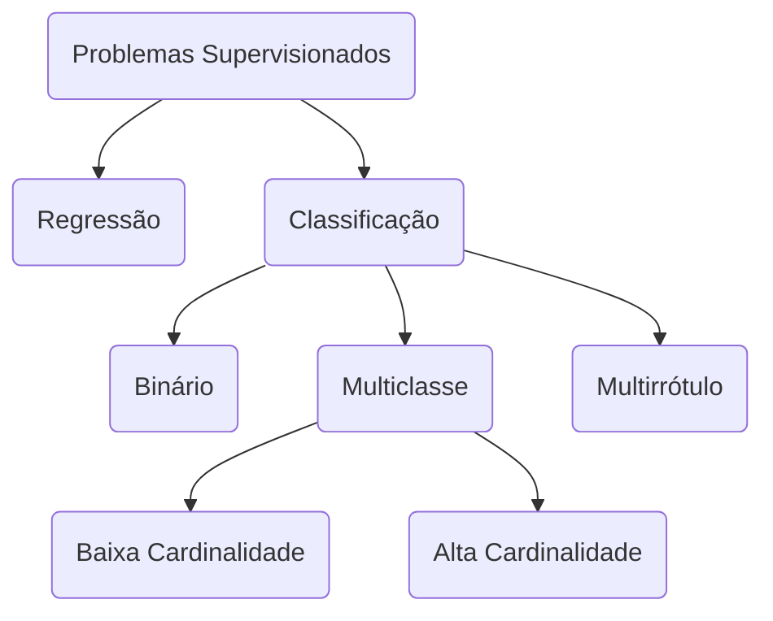

# 1. Definição
Os problemas de [[Aprendizado de Máquina|machine learning]] **supervisionados** são aqueles em que temos rótulos para os dados. O objetivo nesse caso é encontrar padrões em um *dataset* de treino e replicar esses padrões encontrados em um novo *dataset* desconhecido.
Imagine, por exemplo, a situação em que você é um corretor de imóveis e para melhor planejar suas finanças, você gostaria de desenvolver um modelo preditivo para saber o valor no qual o mercado comprará seus imóveis a venda. Pois, uma coisa é avaliar um apartamento ou casa e outra é saber por quanto você conseguirá vender. Ou seja, pode ser que sua casa seja avaliada em R$ 10.000.000,00, mas será que tem alguém disposto a realmente pagar por esse preço?! Nessa situação, o corretor conhecendo os valores de venda de imóveis que foram vendidas no passado e suas características (quantidade de quartos, banheiros, localização e etc.) encontrou padrões e criou um modelo matemático que estabelece o valor predito de venda. Nessas condições, ele utiliza essa equação que foi obtida para estimar o valor de venda.
A classes dos problemas supervisionados podem ainda ser classificadas entre: regressão, e classificação. A regressão tem como *output* valores contínuos, como no exemplo acima da precificação de imóveis, enquanto a classificação tem em seu *output* valores discretos.
Por sua vez, a classificação pode ainda ser do tipo binário, multi-classe ou multi-rótulo. A classificação binária, como o nome sugere, classifica algo em apenas duas classes. Por exemplo, pode-se desenvolver um classificador que determine se há um cachorro em uma foto ou não, dessa forma o classificador terá somente duas saídas: sim ou não. Já um classificador multi-classe, possui múltiplas classes para serem classificadas. Por exemplo, classificar qual o animal de uma imagem, podendo ser cachorro, gato ou cavalo. Existe ainda o multi-rótulo que pode assumir mais de um valor na classificação, por exemplo, imagine um classificador de tópico para artigos científicos, os rótulos possíveis são: finanças, tecnologia, política, saúde. Um artigo científico, entretanto, pode pertencer a mais de um tópico, podendo nessa situação pertencer a tecnologia e saúde, por exemplo.

