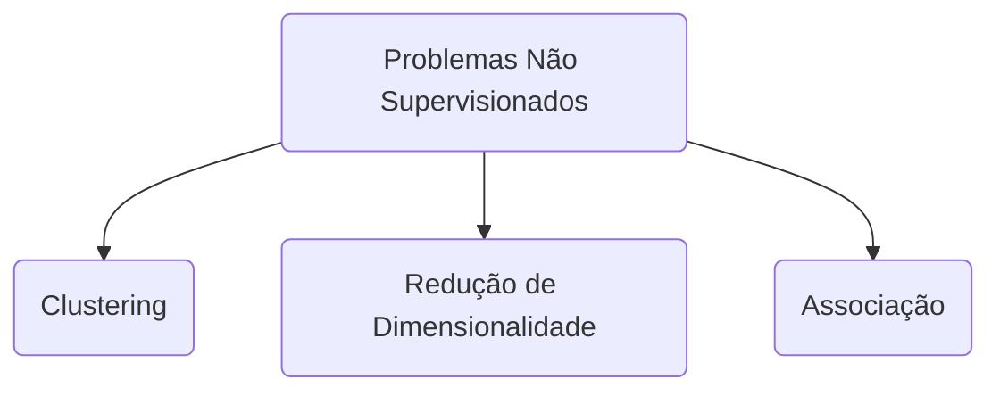

# Definição
Os problemas de [[Aprendizado de Máquina|machine learning]] **não supervisionados** são aqueles em que não temos rótulos para os dados. O objetivo é explorar a estrutura dos dados e encontrar padrões ou agrupamentos.
Imagine, por exemplo, que você é dono de um *e-commerce* e deseja entender o perfil dos seus clientes. Entretanto, você não tem *a priori* essa informação. Nesse cenário, ainda assim é possível realizar uma análise, mas o processo se altera. Em vez de utilizar o rótulo da variável alvo para o treino, aplicamos o treinamento, encontramos padrões e podemos nós mesmos rotular esses padrões, conforme nossa observação. No exemplo proposto, poderíamos aplicar a técnica de *clustering*, agrupando clientes com características semelhantes e entendendo o perfil de cada grupo *a posteriori*.
A classes dos problemas não supervisionados podem ainda ser classificadas entre: *clustering*, redução de dimensionalidade e associação. O *clustering* busca identificar grupos ou *clusters* nos dados, enquanto a redução de dimensionalidade busca simplificar os dados, mantendo suas características mais importantes. Em termos mais simples, ambos agrupam informação similares, agrupando o *clustering* as linhas, ou registros, enquanto a redução de dimensionalidade agrupa colunas. Já a associação busca identificar sequências ou padrões de co-ocorrência nos dados.
