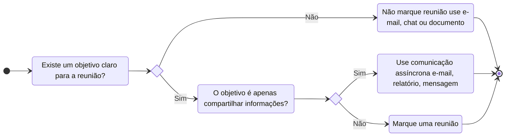

# 1. Definição
O planejamento e condução de reuniões de forma efetiva e com proposito não é uma tarefa fácil! Normalmente nos vemos participando de reuniões sem proposito ou que poderiam ser facilmente resolvidas por um simples *e-mail* ou uma conversa rápida no *Slack*. Portanto, é interessante seguir um modelo de avaliação e planejamento para reuniões, para não desperdiçar o tempo da sua equipe e também para tornar a comunicação mais efetiva e que ao final de cada reunião, o seu objetivo seja alcançado.
# 2. Checklist
- [ ] [[#3. Verificando de necessidade de reunião|Verifique a necessidade de reunião]]
- [ ] [[#4. Identificando o objetivo principal da reunião|Identifique o objetivo principal da reunião]]
- [ ] [[#5. Aplicando *frameworks*|Aplique um framework adequado]]
# 3. Verificando de necessidade de reunião
O primeiro passo é avaliar se de fato existe a necessidade de reunir-se, esse tipo de avaliação pode poupar muito tempo das outras pessoas. Imagine situações que você já participou de reuniões que poderiam ter sido resolvidas por um simples email e tomando muito menos o seu tempo. É justamente para isso que serve essa avaliação.
Em linhas gerais uma reunião somente deve marcada quando se tem um objetivo muito claro e ela não é de apenas compartilhar algumas poucas informações. O diagrama de estado abaixo captura bem a jornada de decisão.

# 4. Identificando o objetivo principal da reunião
Uma vez avaliada e verificada a necessidade de haver uma reunião, deve-se então agora identificar o objetivo principal dessa reunião, uma vez que ele é quem guiará o responsável pela reunião na maneira de conduzir o encontro.
Perceba que a dinâmica de uma reunião de alinhamento e de uma reunião de tomada de decisão devem ser diferentes. Os objetivos são distintos e, portanto, a forma de conduzí-las também deve ser. Em uma reunião de alinhamento, por exemplo, o resultado dela deve ser a consciência da equipe do que cada membro está fazendo e quais são as dificuldades. Enquanto que em uma reunião de tomada de decisão o resultado final dela deve ser a decisão da ação a ser tomada para algum impasse.
Nesse contexto, portanto, é essencial identificar os diferentes tipos de objetivos que se pode ter em uma reunião. Abaixo estão listadas alguns dos objetivos mais comuns:
- Alinhar atividades
- Acompanhar o progresso
- Definir estratégias e/ou metas
- Resolver um impasse ou tomar uma decisão
- Gerar ideias, propor soluções criativas e inovar
- Dar início a um projeto ou iniciativa
- Encerrar um ciclo, avaliar aprendizados ou erros
- Fornecer ou receber feedback individual
- Ensinar novos processos, ferramentas ou práticas
- Deliberar assuntos estratégicos de alta gestão
- Negociar com clientes ou parceiros
- Integrar novos colaboradores ou clientes
- Gerenciar uma crise ou risco urgente
- Fortalecer relações e engajamento da equipe
# 5. Aplicando *frameworks*
Uma vez verificada a necessidade de haver uma reunião e identificado o objetivo principal da reunião, podemos aplicar estruturas ou *frameworks* já consagrados na indústria. Os frameworks são modelos, nesse caso de reuniões, que foram testadas e validadas por terceiros. Portanto, não precisamos reinventar a roda, baseado no objetivo da reunião podemos escolher um determinado *framework* e apenas aplicá-lo.